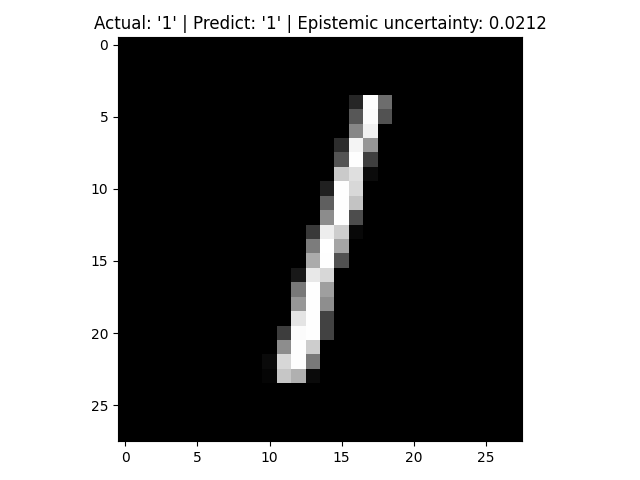
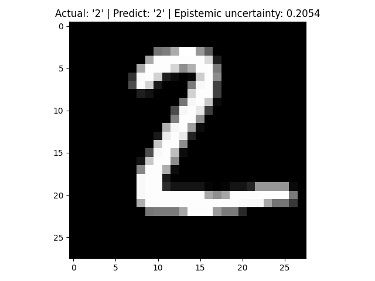
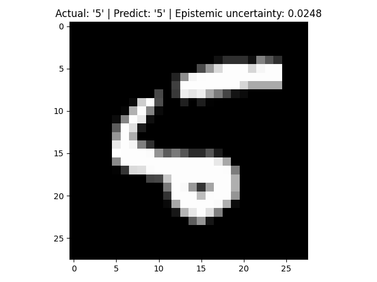
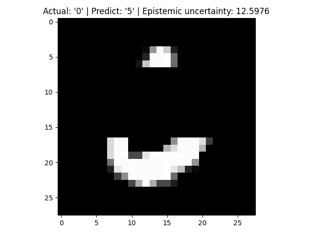
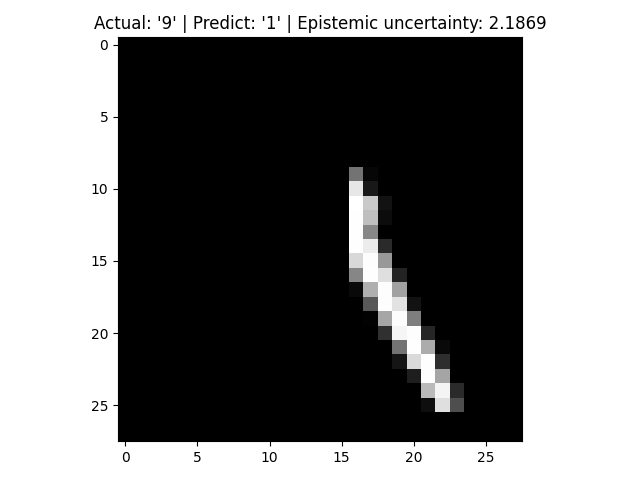
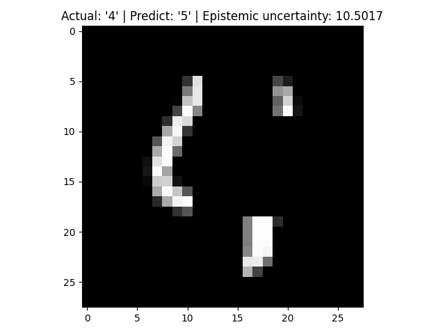
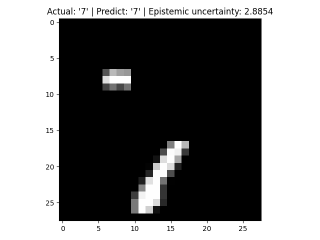

# Uncertainty Quantification

Uncertainty quantification experiment results of classification tasks. [ "What Uncertainties Do We Need in Bayesian Deep Learning for Computer Vision?", NIPS 2017](https://arxiv.org/abs/1703.04977)

## Mnist experiment

The normal images:

The corrupted images:

The more corrupt the image, the higher the cognitive uncertainty. It seems that this is a very simple and effective method.